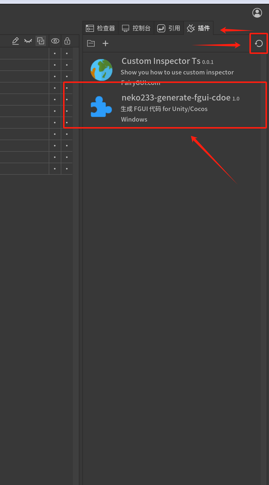
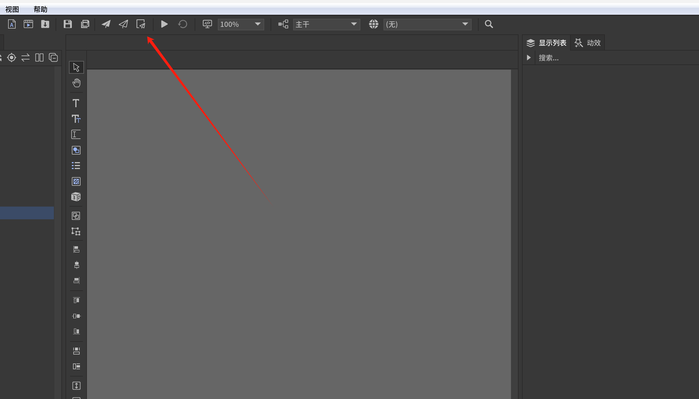
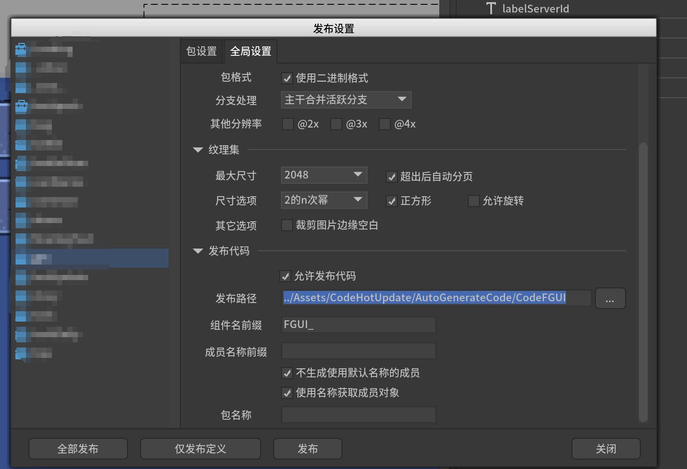

# neko233-fgui-code-generator

FairyGUI Code Generator, used to generate FGUI code in Game Engine.

FairyGUI 代码生成器，用于生成 FGUI 代码


> This project is open-sourced in the hope that it offers some practical value to game developers and contributes, in a small way, to the creativity of game development.   -- neko233
>
> 这个项目开源是希望能为游戏开发者提供一点实用价值，也希望它能在推动游戏创作的路上，neko233 尽一点绵薄之力。

## Support Game Engine (支持的游戏引擎)

1. CocosCreator 
2. Unity

## Language (语言)

1. typescript (CocosCreator) [Default]
2. C# (Unity)


## How To Use ? 

### 1. Install Plugin (安装插件)

```sh
# cd to your project plugins directory
cd {your-fgui-project}/plugins

# clone this repository
git clone https://github.com/SolarisNeko/neko233-fgui-code-generator.git
```
### 2. Refresh Plugin 

Open your FGUI project, and open the plugin settings. refresh it.





### 3. Config Code Generator Path

```sh

../Assets/CodeHotUpdate/AutoGenerateCode/fgui_generate_code/

```


Open `Deploy Config`

打开【发布配置】




See here


